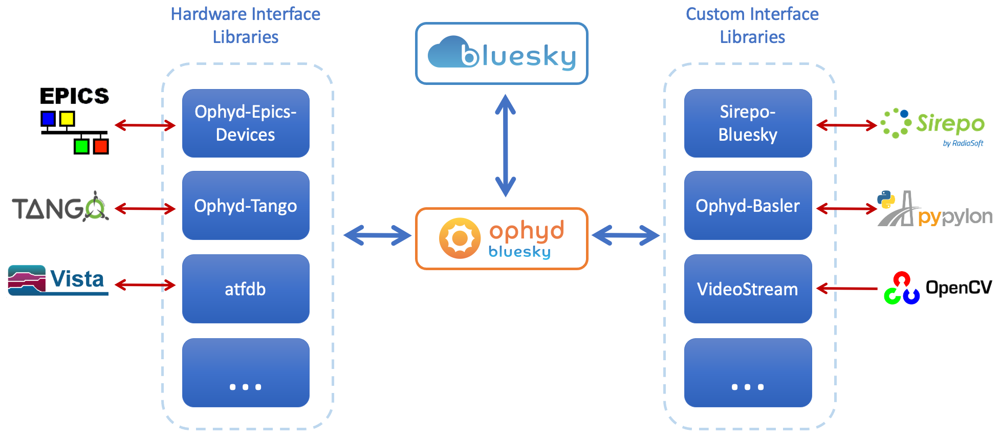
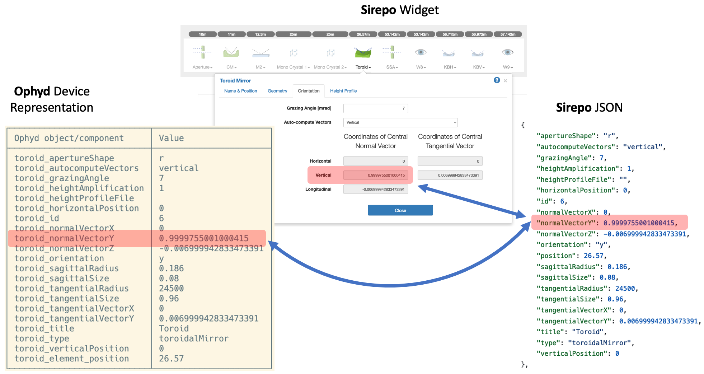
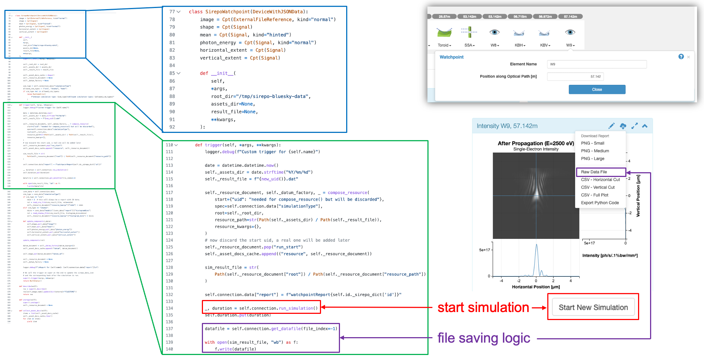

.. _overview:

========
Overview
========

The Sirepo-Bluesky project interfaces two frameworks --- **Sirepo** and
**Bluesky**.

`Sirepo`_ is a framework providing convenient access to various physics
simulation codes (such as `SRW`_, `Shadow3`_, etc.) via an intuitive
browser-based interface.

`Bluesky`_ is a data collection and experiment orchestration framework
routinely used at NSLS-II and other synchrotrons for data collection & data
access, and integrates well with the scientific Python ecosystem. Core Bluesky
components include the `bluesky library`_ for experiment orchestration, the
`ophyd library`_ for device abstractions, and the `databroker library`_ for
convenient access to the experiment data. Relationships of the libraries are
shown at the `Bluesky Project`_ website.

Combining the two systems together enables researchers to perform virtual
experiments using Sirepo as a "digital twin" of a real beamline or an
instrument.

The scheme below shows how the libraries from the Bluesky stack communicate
with other external systems (hardware and software):

The following scheme explains how an optical element in the Sirepo JSON model
turns into an Ophyd ``Device``:

The Watchpoint optical element acts as a virtual detector and the scheme below
demonstrates the code for the corresponding Ophyd class with the ``trigger``
method and the relevant actions in the Sirepo frontent UI:

Please check the :ref:`installation` and the :ref:`examples` sections for more
details on how to get started using Sirepo-Bluesky.

.. _Sirepo: https://www.sirepo.com
.. _Bluesky: https://blueskyproject.io
.. _SRW: https://github.com/ochubar/SRW
.. _Shadow3: https://github.com/oasys-kit/shadow3
.. _bluesky library: https://blueskyproject.io/bluesky
.. _ophyd library: https://blueskyproject.io/ophyd
.. _databroker library: https://blueskyproject.io/databroker
.. _Bluesky Project: https://blueskyproject.io
